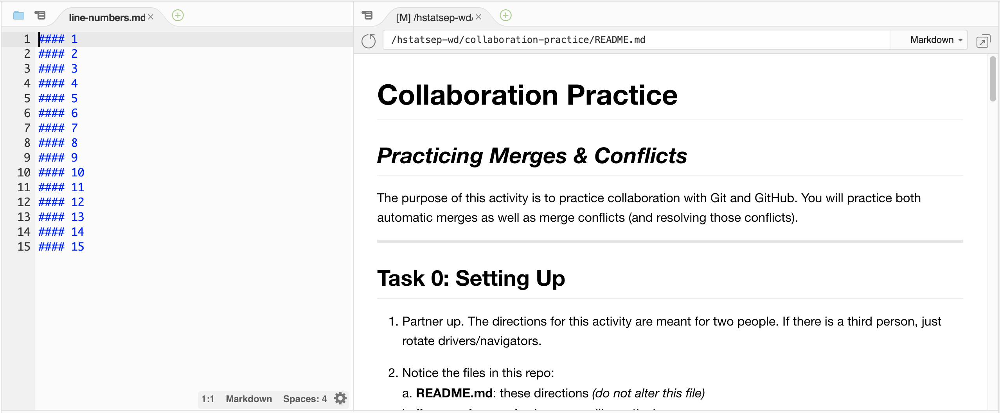

# Collaboration Practice
## _Practicing Merges & Conflicts_

The purpose of this activity is to practice collaboration with Git and GitHub.  You will practice both automatic merges as well as merge conflicts (and resolving those conflicts).

---

## Task 0: Setting Up

1. Partner up. The directions for this activity are meant for two people. If there is a third person, just rotate drivers/navigators.

2. Notice the files in this repo:  
  a. **README.md**: these directions _(do not alter this file)_  
  b. **line-numbers.md**: where you will practice!

3. Decide on ONE person to fork this repo. You are the owner. From now on, you will be referred to as the **owner**. Go ahead and fork this repo.

4. **Owner**: Settings (repo gear icon) > Left sidebar: Manage Access > Invite a collaborator > type your partner's username and then add them. From now on, they will be referred to as the **collaborator**.

5. **Collaborator**: check your email. You should receive an email that contains a link to this remote repo and a message saying "You can now push to this repository." Open the link. (you will NOT fork anything)

6. **Both partners**: copy the `SSH URL` of the _forked repo_ (NOT the original). In your IDE, make sure you are in `~/wd/classwork/` and then `git clone URL`.  Then `cd` into `collaboration-practice`.  

7. The best way to do this activity is to open up:  
  a. the **raw markdown** of `line-numbers.md` _(but you don't need the preview)_  
  b. the **Preview** of `README.md` _(but you don't need the raw markdown)_  
  (see the screenshot below)



NOTE 1: it is easier to see `code snippets` on GitHub, so feel free to read the directions on there instead of in your IDE.  

NOTE 2: after you type each command, make sure you READ what your command line says back to you!  For example, if you type `commiy` instead of `commit`, you will get an error!  If you get into this habit, you will save yourself a lot of headache!

---

## Task 1: Automatic merging _(no errors)_

1. **Owner**: add text to line 1 (after 1).  
_ex:_ `1 Alice was here!`  

2. **Collaborator**: add text to line 3 (NOT line 2).  
_ex:_ `3 Bob was here!`  
### IMPORTANT SIDENOTE: There must be one extra line BETWEEN the edits.  Otherwise, you will get a merge conflict.  

3. **Owner**: `add`, `commit`, and `push`. You shouldn't have any issues.  

4. **Collaborator**: Try to do `git pull`. You will be prompted with an error that ends with:  
```
Please, commit your changes or stash them before you can merge. 
Aborting.  
```  
  a.  So following the directions, you must `add` and `commit`. Go ahead and do that.  
  b.  Well you're in the habit of doing `add`, `commit`, and `push`, so go ahead and try `push`ing. You should see an error:  
```  
hint: Updates were rejected because the tip of your current branch is behind
hint: its remote counterpart. Integrate the remote changes (e.g.
hint: 'git pull ...') before pushing again.
hint: See the 'Note about fast-forwards' in 'git push --help' for details.
```  
  c. So you have to do `git pull`. Then press `^X` (control X) to skip adding a "merge message". You should see the changes merged automatically!  
  d. A quick `git status` will show you that you still need to `push`. Do that.  

5. **Owner**: do a `git pull` to see your collaborator's changes as well!  

6. Let's practice again, but this time in the other direction:  
  a. This time, **collaborator**: add some text to line 5, then `add`/`commit`/`push`.  
  b. And **owner**, you add text to line 7.  
  c. Repeat the same process as above, but this time so that the **owner** has to `pull`.  

7. By the end of this Task, both partners should see

```
1 owner's text
2
3 collaborator's text
4
5 collaborator's text
6
7 owner's text
...
```  

and a `git status` (for both partners) should say:

```
On branch master
Your branch is up-to-date with 'origin/master'.

nothing to commit, working directory clean
```  

---

## Task 2: Merge Conflicts

1. **Owner**: On line 9, write `GitHub is awesome.`  
  a. Then `add`, `commit`, and `push`.

2. **Collaborator**: On line 9, write `GitHub is really good.`  
  a. You can `add` and `commit`, but just like _Task 1_, you have to `pull` before you can `push`.    
  b. You now have your first merge conflict! It should contain:  
```
<<<<<<< HEAD
#### 9 GitHub is really good.
=======
#### 9 GitHub is awesome.
>>>>>>> 7e089a7d32f138cd7e8750eeabf5d80d9812d359
```

3. **Collaborator**: You must fix the merge conflict by doing the following:  
  a. Remove `<<<<<<< HEAD` and `=======` and `>>>>>>> 7e089a7d32f138cd7e8750eeabf5d80d9812d359`. This tells Git that you are resolving the merge conflict.  
  b. Because you are a human, you can make the smart decision about how to merge these two lines. Let's make it say `GitHub is really awesome`.  
  c. Using `git status`, you will see that you have to re-`add`, `commit`, and now you can `push`.

4. **Owner**: `pull`ing will show you the merged line 9.

5. Practice again on line `11`, but this time let the **Owner** resolve the merge conflict. Write whatever sentence you want.

---

## Task 3: More Practice

Continue editing collaboratively! Practice adding, editing, and removing text. When you are editing in the future, you won't have this kind of step-by-step guidance. So just make changes, and practice resolving merge conflicts!
